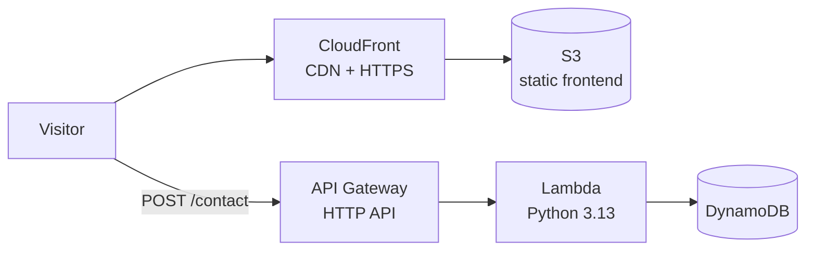

# gustavo.borges — portfolio on AWS

Personal site of **Gustavo Borges, Cloud & Backend Engineer**, built as a real serverless
multi-tier application on AWS — not a static page. The site *is* the first project it
showcases: every tier is provisioned with Terraform and deployed by GitHub Actions.

## Architecture



| Tier | Service | Notes |
| --- | --- | --- |
| Presentation | S3 + CloudFront | React (Vite) build, private bucket behind Origin Access Control |
| API | API Gateway (HTTP) + Lambda | Python, `POST /contact`, throttled, CORS locked to the site origin |
| Data | DynamoDB | On-demand billing, stores contact messages |
| IaC | Terraform | Everything above reproducible from zero |
| CI/CD | GitHub Actions | OIDC to AWS (no stored keys): build → S3 sync → CloudFront invalidation → Lambda update |

**Phase 2 (planned):** a scheduled data pipeline (EventBridge → Lambda → S3 data lake in
partitioned Parquet → Glue Data Catalog + Athena) feeding a live dashboard section through
the same API.

## Repository layout

```
frontend/            React + Vite + TypeScript site
backend/contact/     Lambda handler (Python) for the contact form
terraform/           All infrastructure as code
.github/workflows/   Deploy pipeline
```

## Local development

```sh
cd frontend
npm install
npm run dev
```

Without `VITE_API_URL` set, the contact form falls back to a `mailto:` link.

## Provisioning

Requires Terraform ≥ 1.7 and AWS credentials with admin-ish rights (first apply only).

```sh
cd terraform
terraform init
terraform apply -var "budget_alert_email=you@example.com"
```

Then set the Terraform outputs as **GitHub repository variables** so the pipeline can deploy:
`AWS_DEPLOY_ROLE_ARN`, `S3_BUCKET`, `CLOUDFRONT_DISTRIBUTION_ID`, `LAMBDA_FUNCTION_NAME`
and `API_URL` (used at build time as `VITE_API_URL`). Every push to `main` then ships
frontend + Lambda automatically.

## Cost

Designed to run inside the AWS free tier: no NAT Gateway, no Glue ETL jobs, no Redshift.
CloudFront uses the default certificate and `PriceClass_100`; DynamoDB and Lambda are
on-demand. A $1 monthly AWS Budget alarm (actual + forecast) is part of the Terraform, so
drift from "basically free" pages me before it costs anything.
